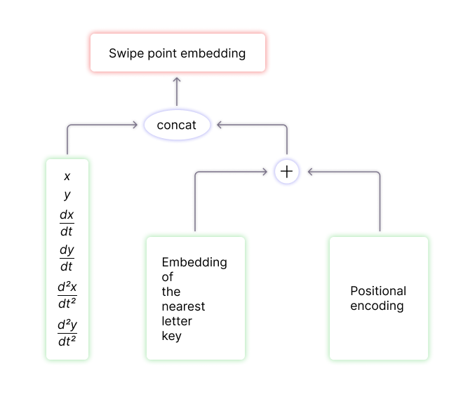
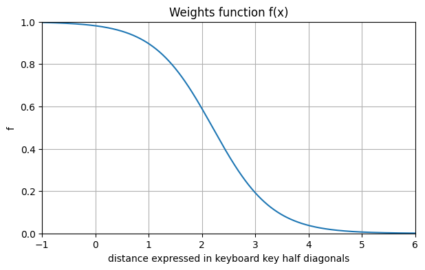
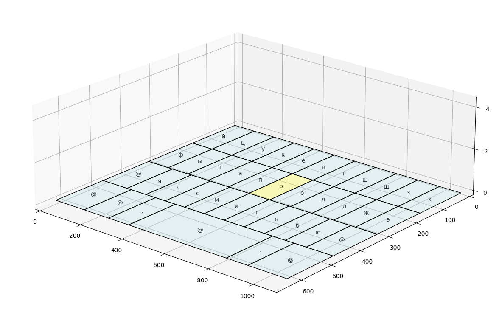
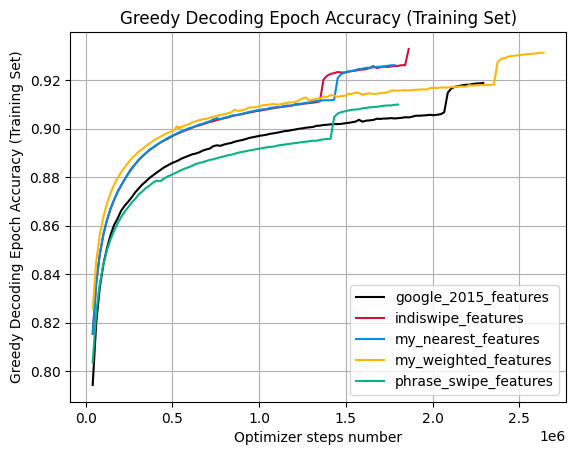
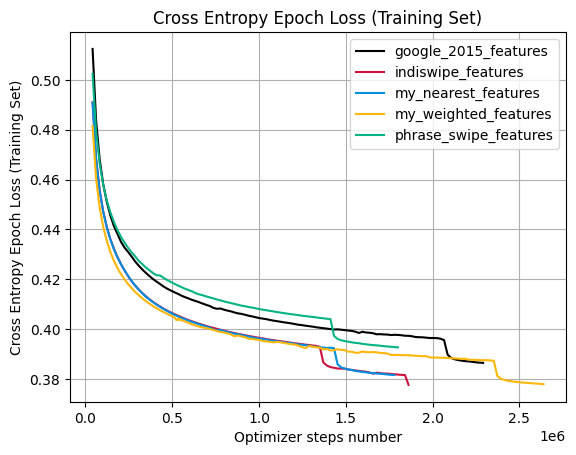

# NeuroSwipe

A transformer neural network for a gesture keyboard that transduces curves swiped across a keyboard into word candidates.

This repository used to contain my Yandex Cup 2023 solution (7th place), but after many improvements, it has become a standalone project.

## Demo

You can try out one of the models trained during the competition in a [web app](https://proshian.pythonanywhere.com/)


If the website is not available, you can run the demo yourself by following the instructions in [the web app's GitHub repository](https://github.com/proshian/neuroswipe_inference_web).


## Existing Work
1)  Alsharif O. et al. Long short term memory neural network for keyboard gesture decoding //2015 IEEE International Conference on Acoustics, Speech and Signal Processing (ICASSP). – IEEE, 2015. – P. 2076-2080.
2) Xu Z. et al. Phrase-Gesture Typing on Smartphones //Proceedings of the 35th Annual ACM Symposium on User Interface Software and Technology. – 2022. – P. 1-11.
3) Biju E. et al. Joint transformer/RNN architecture for gesture typing in indic languages // Proceedings of the 28th International Conference on Computational Linguistics. – 2022 – P. 999–1010.
4) Jia N., Zhang Y., Wu Q. Enhancing Swipe Typing with Gated Linear Transformer //2024 International Conference on Emerging Smart Computing and Informatics (ESCI). – IEEE, 2024. – P. 1-6.


<br>

Methods comparison

<table width="1068">
<tbody>
<tr>
<td width="174">
<p>Method</p>
</td>
<td width="89">
<p>Year</p>
</td>
<td width="177">
<p>Model</p>
</td>
<td width="147">
<p>Model type</p>
</td>
<td width="367">
<p>Swipe point embedding</p>
</td>
<td width="113">
<p>Params num</p>
</td>
</tr>
<tr>
<td width="174">
<p>LSTM for KGD (1)</p>
</td>
<td width="89">
<p>2015</p>
</td>
<td width="177">
<p>Peephole BiLSTM</p>
</td>
<td width="147">
<p>Encoder-only</p>
</td>
<td width="367">
<pre><code>concat(
   nearest_key_one_hot,
   x, y, t)
</code></pre>
</td>
<td width="113">
<p>1.5</p>
</td>
</tr>

<tr>
<td width="174">
<p>Phrase Gesture Typing (2)</p>
</td>
<td width="89">
<p>2022</p>
</td>
<td width="177">
<p>Encoder: Bert Base,</p>
<p>Decoder: Bert Base</p>
</td>
<td width="147">
<p>Encoder-decoder</p>
</td>
<td width="367">
<pre><code>nearest_key_embedding
</code></pre>
</td>
<td width="113">
<p>220</p>
</td>
</tr>

<tr>
<td width="174">
<p>Joint Transformer/</p>
<p>RNN for Indic Keyboard (3)</p>
</td>
<td width="89">
<p>2022</p>
</td>
<td width="177">
<p>Encoder: Transformer + GA + LSTM;</p>
<p>Contrastive distance: ELMo</p>
</td>
<td width="147">
<p>Encoder-only and Contrastive Distance</p>
</td>
<td width="367">
<pre>concat(
   nearest_key_one_hot,
   x, y, dx/dt, dy/dt)
</pre>
</td>
<td width="113">
<p>not stated <!--<b>TODO: COMPUTE THE VALUE</b>--> </p>
</td>
</tr>

<tr>
<td width="174">
<p>Linear Transformer (4)</p>
</td>
<td width="89">
<p>2024</p>
</td>
<td width="177">
<p>Gated Linear Transformer</p>
</td>
<td width="147">
<p>Encoder-only</p>
</td>
<td width="367">
<pre>sum(
   nearest_key_embedding,
   coorinate_embedding)
</pre>
</td>
<td width="113">
<p>0.654</p>
</td>
</tr>

</tbody>
</table>


From the table above, it can be seen that all existing approaches use similar swipe point embeddings based on the embedding of the nearest key, and other options have not been explored.

At the same time, a hypothesis arises that including information about all keys on the keyboard in the embeddings can mitigate the noise inherent to this task and more accurately reflect the user's interaction with the keyboard. Thus, the research presented in this repository mainly focuses on swipe point representations and their effect on metrics.

## Method

### Model

The model is an encoder-decoder transformer with the following hyperparameters:

|        Hyperparameter        | Value |
| ---------------------------- | ----- |
| Encoder layers number        | 4     |
| Decoder layers number        | 4     |
| Model Dimension              | 128   |
| Feedforward layer dimension  | 128   |
| Encoder heads number         | 4     |
| Decoder heads number         | 4     |
| Activation function          | ReLU  |
| Dropout                      | 0.1   |

All experiments utilize this exact model, with the primary difference between the experiments being in the swipe-dot-embedding-layer (embeddings that are encoder input).

Encoder input is a sequence of `swipe point embeddings`. They are described in a dedicated section.

Decoder input is a sequence of trainable embeddings (with positional encoding) of tokens extracted from the target word. In yhis research tokens include all alphabet characters and special tokens (`<sos>`, `<eos>`, `<unk>`, `<pad>`), however the bpe tokens or wordpiece tokens are suitable as well.

The positional encoding is the same as in "Attention is all you need": it's a fixed embedding based on harmonic oscilations.

> [!NOTE]  
> In my research, keyboard key embeddings used in the encoder and character embeddings used in the decoder are different entities.

### Other Models

* There were experiments where the first transformer encoder layer can input a sequence with elements of a dimension different from other encoder layers. I used this kind of custom transformer in Yandex Cup 23, but I don't see the difference in performance or parameter economy as substantial.
* There was an experiment with a larger model: it seems like there is great potential (higher word_level_accuracy with less optimizer steps), but it's too computationalyy expensive to train for me.
   * The larger model params: Encoder layers number: 8; Decoder layers number: 8; Model Dimension: 512; Feedforward layer dimension: 2048; Encoder heads number: 8; Decoder heads number: 8; Activation function: ReLU; Dropout: 0.1


### Swipe Point Embeddings


Swipe point embeddings (encoder input) are formed by combining two types of features (though one of them can be omitted): 
1) Features that regard a point as a part of a trajectory
    * Examples: `x`, `y` coordinates; time since beginning of the swipe; $\frac{dx}{dt}$, $\frac{dy}{dt}$; etc.
2) Features that regard a point as a location on a keyboard
    * Examples: a trainable embedding of the nearest keyboard key; a vector of distances between the swipe point and every keyboard key center; etc.

This concept of swipe point embeddings holds true for both: methods presented here and those found in the literature.

> [!NOTE]  
> "SPE" in the sections below stands for Swipe Point Embedding.


#### SPE that uses the nearest key embedding (My Nearest SPE)

This method is the same as IndicSwipe method but uses second derivatives alongside with other features.

The computational graph of a `swipe point embedding` is shown in the image below.

|  |
|:--:|
|*Figure 1: Swipe Point Embedding Computation Graph*|

The $\frac{dx}{dt}$, $\frac{dy}{dt}$, $\frac{d^2x}{dt^2}$, $\frac{d^2y}{dt^2}$ derivatives are calculated using the finite difference method.


#### SPE that uses a weighted sum of all key embedding (My Weighted SPE)

This is a new method invented in this research that is not found in the literature: all the papers use only the nearest keyboard key embedding when constructing a swipe point embedding.

It is similar to `My nearest SPE` described above, but instead of `the nearest keyboard key embedding` a `weighted sum of all keyboard key embeddings` is used.

$$ embedding = \sum_{key}f(d_{key}) \cdot embedding_{key}$$


Where $d_{key}$ is the distance between between the swipe point and the $key$ center, $f(d_{key})$ is a function that given a distance returns the $key$ weight and $embedding_{key}$ is the $key$'s embedding.

The hyperparameter of the method is the choice of the weighting function $f$. It is assumed that the argument of the function $f$ is the distance from the point to the center of the key, expressed in half-diagonals of the keys. The range of acceptable values is the interval from 0 to 1.

It should be noted that this method is almost the same as `My nearest SPE` if $f$ is a threshold function that returns 1 if $d_{key}$ is less than half the diagonal of the key, and 0 otherwise.


Since the swipes are noisy by their nature and their trajectory often doesn't cross the target keys but always passes near them, the idea arises to take into account all the keys (or in other words, to replace the threshold function with a smooth one).


The weighting function used in this work, along with its graph, is presented below. It is a reflected, right-shifted sigmoid with a sharpened transition from 1 to 0.

$$f(x) = \frac{1}{1+e^{1.8 \cdot (x - 2.2)}}$$


|  |
|:--:|
| *Figure 2: Weights function.* |


In the graph below, the z-axis shows the weight of key `p` (highlighted in yellow) for each point on the keyboard. For other keys, this surface will be the same, just centered at a different point. For a clear view of the keyboard there is a separate image without the surface.


|  |
|:--:|
|  |
| *Figure 3: 'р' key weight for each point on the keyboard.* |

## Extra Info

Some extra info can be found [solution_extra_info.md](solution_extra_info.md) file (in Russian and may be outdated) and in my [master's thesis](https://drive.google.com/file/d/1ad9zlfgfy6kOA-41GxjUQIzr8cWuaqxL/view?usp=sharing) (in Russian)


## Swipe MRR Metric

$$
Swipe MRR = I[cand_1==target] + I[cand_2== target] \cdot 0.1 + I[cand_3== target] \cdot 0.09 + I[cand_4== target] \cdot 0.08
$$


* $I$ is an indicator functoin (returns 1 if the condition in square brackets is met, otherwise returns 0)
* $cand_i$ is the $𝑖$-th word candidate list element

All word candidates must be unique. The duplicates are excluded when the metric is calculated


The use of the Swipe MRR metric is justified by the fact that the first candidate will be automatically inserted into the typed message, while the other three will be suggested on the panel above so that a user can use one of them instead. This approach allows assessing the quality of the model, taking into account all the words it suggests on inference.

## Results

Table demonstrating the correspondence of colors on graphs and features used to create a SPE:

<table>
   <thead>
      <tr>
            <th>Color</th>
            <th>Feats Type Name</th>
            <th>Paper-Link</th>
            <th>Trajectory features used</th>
            <th>Keyboard-keys-related features used</th>
      </tr>
   </thead>
   <tbody>
      <tr>
            <td></td>
            <td>Weighted features (OURS)</td>
            <td><a href="https://drive.google.com/file/d/1ad9zlfgfy6kOA-41GxjUQIzr8cWuaqxL/view?usp=sharing">master's thesis</a> (in Russian)</td>
            <td>x, y, x', y', x'', y''</td>
            <td>weighted sum as described above</td>
      </tr>
      <tr>
            <td></td>
            <td>Nearest features (OURS)</td>
            <td><a href="https://drive.google.com/file/d/1ad9zlfgfy6kOA-41GxjUQIzr8cWuaqxL/view?usp=sharing">master's thesis</a> (in Russian)</td>
            <td>x, y, x', y', x'', y''</td>
            <td>nearest key</td>
      </tr>
      <tr>
            <td></td>
            <td>IndicSwipe_features</td>
            <td>(3) In "Existing work section"</td>
            <td>x, y, x', y'</td>
            <td>nearest key</td>
      </tr>
      <tr>
            <td></td>
            <td>Google_2015_features</td>
            <td>(1) In "Existing work section"</td>
            <td>x, y, t</td>
            <td>nearest key</td>
      </tr>
      <tr>
            <td></td>
            <td>PhraseSwipe_features</td>
            <td>(2) In "Existing work section"</td>
            <td>None</td>
            <td>nearest key</td>
      </tr>
   </tbody>
</table>


During inference, models utilize a variant of beam search that masks logits corresponding to impossible token continuations given a generated prefix. Consequently, the most important metric of the model performance is Swipe MRR when the model is used with "beamsearch with masking". 


The graph below shows that the method proposed in this work demonstrates higher values for both Accuracy and Swipe MRR.


|  |
|:--:|
| *Figure 4: Comparison of model performance using beam search with masking* |


The table below demonstrates the best metric values from the graph above for each method. It shows that the developed SPE delivers higher quality than the best SPE used in articles. Specifically, the increase in Swipe MRR is 0.67%, and the increase in accuracy is 0.73%.


| report_feat_names        |    mmr |   accuracy |   accuracy_epoch |   accuracy_epoch |   Max considered epoch |
|--------------------------|--------|------------|------------------|------------------|------------------------|
| Weighted features (OURS) | 0.8922 |     0.8865 |               90 |               90 |                    128 |
| Nearest features (OURS)  | 0.8886 |     0.8826 |               73 |               73 |                     86 |
| Indiswipe_features       | 0.8863 |     0.8801 |               31 |               31 |                     90 |
| Google_2015_features     | 0.8815 |     0.875  |              104 |              104 |                    111 |
| Phrase_swipe_features    | 0.8712 |     0.8645 |               55 |               55 |                     87 |


| Features Type            | Swipe MRR   | Accuracy   |
|--------------------------|-------------|------------|
| Weighted features (OURS) | 0.8922      | 0.8865     |
| Indiswipe_features       | 0.8863      | 0.8801     |
| **Δ**                    | **0.67%**   | **0.73%**  |


The metrics below present word-level accuracy using greedy decoding and cross-entropy loss on the training set. These metrics are essential for understanding the variance and bias of the models when compared to the validation metrics discussed subsequently. 


<!-- 
Greedy decoding word level accuracy (train set) | CE loss (train set)
:-------------------------:|:-------------------------:
  |  
-->

<table>
  <tr>
    <td align="center">
      
    </td>
    <td align="center">
      
    </td>
  </tr>
  <tr>
    <td colspan="2" align="center"><em>Figure 5: Greedy Decoding Word-Level Accuracy and Cross-Entropy Loss on the Training Set</em></td>
  </tr>
</table>


On the grahs below on the left, there is a graph showing word-level accuracy with greedy decoding. It can be observed that our method of SPE also leads here, and the results are similar to those obtained with beam search, just lower, which is expected for greedy decoding.

The greedy decoding word-level accuracy is used as a very cheap proxy metric. It's cheapness comes from the fact that it is equal to a word-level accuracy during transformer training without any decoding algorithm applied at all. 

<!--
Greedy decoding word level accuracy (validation set) | CE loss (validation set)
:-------------------------:|:-------------------------:
 | 
-->

<table>
  <tr>
    <td align="center">
      
    </td>
    <td align="center">
      
    </td>
  </tr>
  <tr>
    <td colspan="2" align="center"><em>Figure 6: Greedy Decoding Word-Level Accuracy and Cross-Entropy Loss on the Validation Set</em></td>
  </tr>
</table>


The metrics below demonstrate the token-level F-score and accuracy on the validation set. The ranking of models by quality level here matches the previous graphs. It is also worth noting that the increase in token-level accuracy suggests that with further training, we may achieve an even greater improvement in word-level accuracy.

<!--
token level accuracy (validation set) | token level f1-score (validation set)
:-------------------------:|:-------------------------:
 | 
-->

<table>
  <tr>
    <td align="center">
      
    </td>
    <td align="center">
      
    </td>
  </tr>
  <tr>
    <td colspan="2" align="center"><em>Figure 7: Token-Level Accuracy and F1-Score on the Validation Set</em></td>
  </tr>
</table>


> [!NOTE]  
> The abrupt changes in metrics are due to decreases in the learning rate. The ReduceLROnPlateau scheduler reduces the learning rate by half if validation loss does not improve for over 20 epochs.

In this task, decreasing the learning rate when learning stagnates does not yield benefits: all models began overfitting rapidly after the learning rate decreased, as indicated by the increased CE loss on the validation set (Figure 6, right). Interestingly, token-level accuracy and F1-score improved on the validation set after the learning rate decrease (Figure 7), whereas word-level metrics on the validation set declined or didn't change (Figure 6, left; Figure 4). This suggests that while the model's token-level accuracy (correct-predictions-frequency) improved, it became overly confident in incorrect predictions, leading to higher CE loss.


### Conclusion

As a result of the research, a four-layer transformer with a new swipe point representation method was developed and trained. The developed method for constructing swipe point embeddings (SPE) uses a weighted sum of embeddings of all keys, as well as the swipe trajectory coordinates and their derivatives up to the second order. The designed type of embedding helps to mitigate noise in the data and more accurately reflects user interactions with the keyboard. The main outcome was an increase in Swipe MMR by 0.67% and Accuracy by 0.73% on the validation set using beam search, compared to existing approaches for constructing SPE. To test the method, a keyboard prototype was created in the form of a web application.


## Prerequisites

Install the dependencies:

```sh
pip install -r requirements.txt
```

* The inference was tested with python 3.10
* The training was done in kaggle on Tesla P100


<!--

## Yandex cup dataset


**TODO: Fill the instructions to obtain the dataset**

-->


<!-- 

```sh
python ./src/downloaders/download_dataset_separated_grid.py
``` 

-->

## Your Custom Dataset

To train on a custom dataset you should provide a pytorch `Dataset` class child. Each element of the dataset should be a tuple: `(x, y, t, grid_name, tgt_word)`. These raw features won't be used but there are transforms defined in `feature_extractors.py` corresponding to every type of `swipe point embedding layer` that extract the needed features. You can apply these transforms in your dataset's `__init__` method or in `__get_item__` / `__iter__`.

All the features end up in this format: `(encoder_input, decoder_input), decoder_output`.

* `decoder_input` and `decoder_output` are `tokenized_target_word[1:]` and `tokenized_target_word[:-1]` correspondingly.
* `encoder_input` are features for swipe_point_embedding layer and depend on which SPE layer you use

You also need to add your keyboard layout to `grid_name_to_grid.json`

<!--

**TODO: Add info on how exactly the dataset should be integrated** 

-->

## Training

<!-- Перед побучением необходимо очистить тренировочный датасет -->

The training is done in [train.ipynb](src/train.ipynb)

> [!WARNING]  
> `train.ipynb` drains RAM when using `n_workers` > 0 in Dataloader. This can result in up to `dataset_size * n_workers` extra gigabytes of RAM usage. This is a known issue (see [here](https://github.com/pytorch/pytorch/issues/13246)) that happens when a dataset uses a list to store data. Although `torch.cuda.empty_cache()` can be used as a workaround, it doesn't seem to work with pytorch lightning. It appears I didn't commit this workaround, but you can adapt train.ipynb from [before-lightning branch](https://github.com/proshian/neuroswipe/tree/before-lightning) by adding ```torch.cuda.empty_cache()``` after each epoch to to avoid the issue. When training in a kaggle notebook, the issue is not a problem since a kaggle session comes with 30 Gb of RAM.  


## Prediction

[word_generation_demo.ipynb](src/word_generation_demo.ipynb) serves as an example on how to predict via a trained model.

[predict_v2.py](src/predict_v2.py) is used to obtain word candidates for a whole dataset and pickle them

> [!WARNING]  
> If the decoding algorithm in `predict_v2.py` script utilizes a vocabulary for masking (if `use_vocab_for_generation: true` in the config), it is necessary to disable multiprocessing by passing the command-line argument `--num-workers 0` to the script. Otherwise, the prediction will take a long time. It's a bug that will be fixed


## Yandex cup 2023 submission reproduction instructions
Yandex cup 2023 submission reprodction instructions are [here: submission_reproduciton_instrucitons.md](submission_reproduciton_instrucitons.md)


## Thank you for your attention


## For future me
See [refactoring plan](./Refactoring_plan.md)