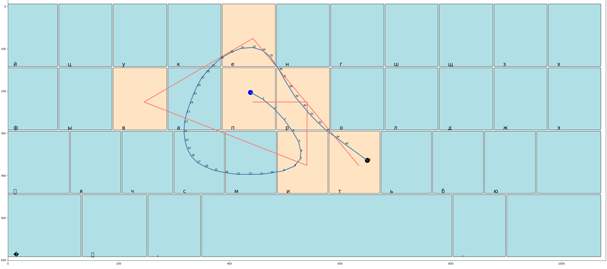

    

        <h1 class="title">NeuroSwipe</h1>
    

    

        

            
<strong>Ваша задача</strong> — разработать модель, которая будет предсказывать слово, набранное с помощью свайпа по клавиатуре. 

            
В вашем распоряжении:

            <ul>
                <li>данные о траектории движения пальца по клавиатуре: координаты и время;</li>
                <li>слово, которое хочет набрать писатель;</li>
                <li>информация о раскладке клавиатуры.</li>
            </ul>
            <h3>Метрика</h3>
            Для оценки качества работы вашей модели рекомендуется использовать метрики, которые показывают степень согласованности предсказанных слов с теми, что хотел ввести пользователь. Такими метриками может выступать CER, Accuracy@k и др. Однако, в данном случае мы будем использовать специально разработанную для клавиатур метрику под названием Swipe MRR:
            
<code>Swipe MRR = I[cand1 == target] + I[cand2 == target] * 0.1 + I[cand3 == target] * 0.09 + I[cand4 == target] * 0.08, где все кандидаты уникальны.</code>

            
Применение метрики Swipe MRR обусловлено тем, что первый кандидат будет автоматически вписан в набранное сообщение, а остальные три будут предложены на панели выше для возможной замены. Такой подход позволяет оценить качество модели с учетом автоматической замены кандидатов на основе предпочтений пользователя, что является актуальным для клавиатурных предсказаний.

        

    

    <h2>Формат ввода</h2>
    

        

#### Описание данных

Данные предоставляются в формате JSON на каждой строке следующего содержания:

*   word – таргет (слово, которое хотел ввести пользователь)
*   curve
    *   x – массив координат X
    *   y – массив координат Y
    *   t – массив временных меток (время в миллисекундах)
    *   grid – формат раскладким
        *   grid\_name – название раскладки (default или extra)
        *   width – ширина раскладки
        *   height – высота раскладки
        *   keys – массив клавиш
            *   label – символ клавиши
            *   hitbox – область нажатия
                *   x – координата X верхнего левого угла
                *   y – координата Y верхнего левого угла
                *   w – ширина области
                *   h – высота области
                
            <h4>Основные наборы</h4>
            
Данные были собраны путем разметки, когда пользователей просили ввести слово, отображенное на экране, с использованием свайпа.

            
1) <strong>train.jsonl</strong> – содержит данные о кривых и слово, которое пользователь хотел ввести.

            
2) <strong>valid.jsonl</strong> – данные для валидации, с таргетом, хранящимся в <strong>valid.ref</strong>.

            
3) <strong>test.jsonl</strong> – данные, для которых вам нужно предсказать наиболее вероятные слова.

            
4) <strong>voc.txt</strong> – словарь с словами, которые могут быть таргетом. Важно отметить, что не обязательно для каждого слова из словаря существует соответствующий пример в контесте.

            
Скачать данные можно по <a href="https://disk.yandex.ru/d/IYiSpLob-zAxqg">ссылке</a>.

            <h4>Дополнительные наборы</h4>
            
Так же мы предоставляем дополнительный архив с кривыми, которые вводились пользователями в Яндекс.Клавиатуре:

            
1) <strong>suggestion_accepted</strong> - кривые, на которых пользователь явно выбрал какую-то подсказку вместо первой.

            
2) <strong>accepted</strong> - кривые, которые пользователь принял и продолжил дальнейший ввод без отмен. Возможно, распознавание сработало некорректно, и пользователь попросту не заметил ошибку.

            
Стоит отметить, что в данном наборе данных, в отличие от предыдущего, раскладки клавиатуры могут иметь произвольный вид: разные размеры по ширине и высоте, наличие или отсутствие дополнительных клавиш. Название сетки (grid_name) также может быть разнообразным и отличаться от "default" и "extra".

            
Скачать данные можно по <a href="https://disk.yandex.ru/d/-qAoI9Ux1eP7XQ">ссылке</a>.

        

    

    <h2>Формат вывода</h2>
    

        

            
Сохраните первые четыре кандидата для каждой кривой из файла test.jsonl в формате CSV без использования заголовков и индекса. Для этого используйте следующий код: <code>df.to_csv(path, header=False, index=False)</code>.

        

    

    <h2>Примечания</h2>
    

        

            <h3>Бейзлайн</h3>
            
<strong>DTW (Dynamic Time Warping)</strong> – метрика, которая помогает вычислить расстояние между двумя кривыми разной длины. В качестве бейзлайна используются первые слова, определенные по DTW между кривой пользователя и кривыми, составленными на основе центров кнопок букв на клавиатуре.

            
Вы можете попробовать запустить бейзлайн с помощью файла <code>run_baseline.sh</code> и затем загрузить ответ в контест. Ожидается, что вы получите значение метрики <strong>Swipe MRR@4: 0.248</strong>.

            <h3>Визуализация</h3>
            
Для лучшего понимания данных мы подготовили инструмент для визуализации данных. Вы можете запустить его с помощью файла <code>run_viz.py</code> (работает только на трейн данных, но вы можете адаптировать инструмент). Использование этого инструмента позволит вам наглядно увидеть и проанализировать предоставленные данные, что может помочь в создании более точной модели.

            
Скачать бейзлайн с визуализацией вы можете по <a href="https://disk.yandex.ru/d/7X00apgDmcqfkw">ссылке</a>.

            

                Пример кривой для слова "привет".

        

    

